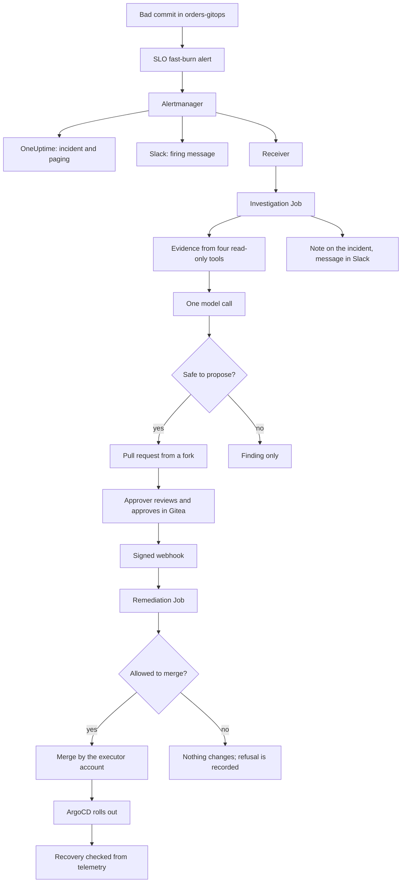
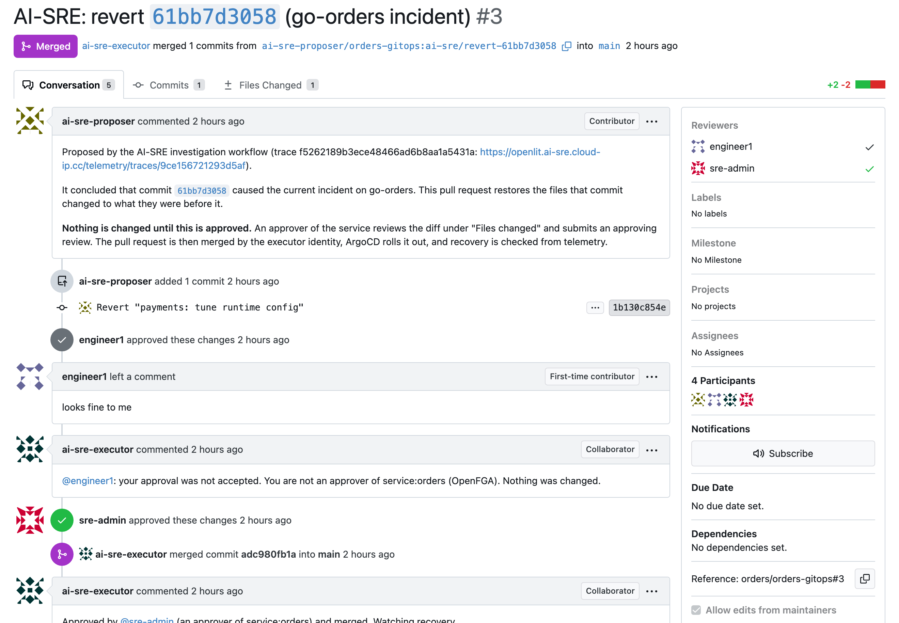
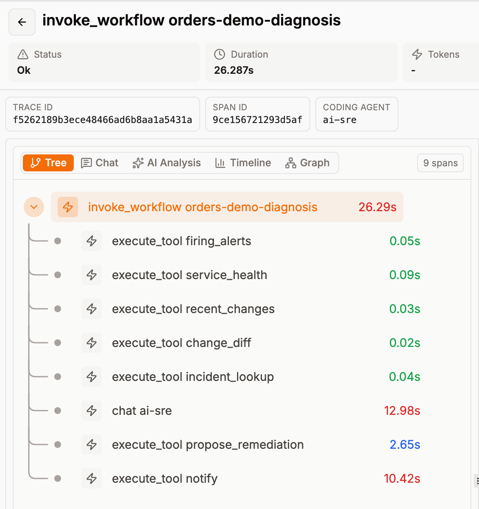
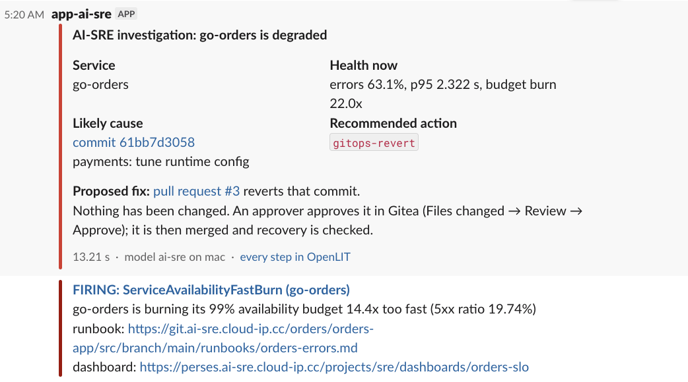
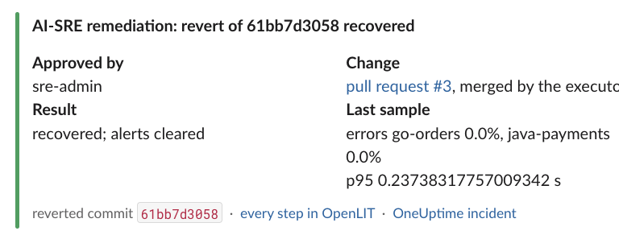
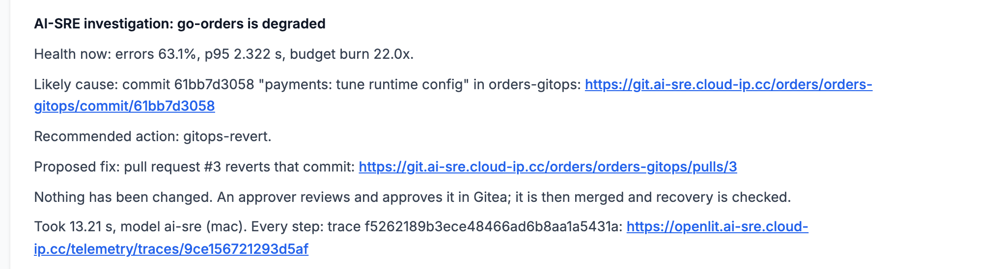

# AI-SRE: From Alert to a Fix Ready for Approval in 17 Seconds

## The incident in brief

- Someone pushes a config change to the GitOps repository. It looks harmless ("payments: tune runtime
    config"), but it makes half the requests fail and adds 600 ms to the rest.
- About eight minutes later the SLO fast-burn alert fires for `go-orders`.
- Seventeen seconds after the alert arrives, a pull request that reverts the commit is open in Gitea.
    - Its description names the commit, says why, and links to a trace of every step.
    - The same finding is in Slack and on the OneUptime incident.
    - Nothing in the cluster has changed yet.
- An SRE opens the pull request, reads a four-line diff and approves it.
- The revert is merged, ArgoCD rolls it out, and the workflow watches the error rate until the service
    is healthy again.

The rest of this piece covers how that works, what went wrong on the way, and how far the result can
be trusted.

## What it is for

- In a bad-deploy incident the fix is usually a revert, and the revert takes a minute.
- The slow part comes before it: reading the alert, checking which service is really broken, listing
    recent changes, reading diffs and deciding which change to blame.
- That part is mechanical enough to automate. The on-call engineer then starts with a proposed fix to
    judge instead of a blank page.

Two rules were fixed before anything was built:

- The automation must never change production on its own judgement.
- Paging has to work exactly as before, whether the automation runs, fails or is switched off.

## The constraints that shaped it

- **One small server.** 4 cores, 32 GB of memory, no GPU, shared with the whole platform.
- **No hosted model API.** That leaves room for a small model only: about 3 billion parameters on the
    server, or 7 billion on a laptop GPU when the laptop is online.
- **Small models cannot run an investigation themselves.**
    - Given tools and asked to work out what was wrong, the chosen model made sensible tool calls and
        then failed to give a usable answer. Two live attempts took 58 and 125 seconds.
    - Asked one well-prepared question, the same model answered correctly in a few seconds.
    - So the investigation is ordinary code and the model is called once. More in *AI-SRE: Why Not an
        Autonomous Agent*.
- **Everything is deployed through Git.** All changes reach the cluster through Git and ArgoCD, so a
    fix is a commit and a proposed fix can be a pull request.

## How it works



**Step 1: the alert starts a Job**

- Alertmanager already sent this alert to OneUptime and Slack. A third route was added at the end of
    the list, to a small receiver inside the cluster.
- The receiver does one thing: it starts a Kubernetes Job. It has no other credentials and makes no
    decisions.

**Step 2: code collects the evidence**

- Four read-only tools: which alerts are firing, the error rate and latency of each service, the
    commits to the GitOps repository in the last hour, and the diff of each commit.
- This takes about a fifth of a second.

**Step 3: the model answers one question**

- The evidence goes to the model in one request of roughly 540 tokens.
- The reply must have a fixed shape:

```json
{"incident": true, "service": "go-orders", "commit": "61bb7d3058", "action": "gitops-revert"}
```

**Step 4: code decides whether to propose a fix**

From here on the model is out of the picture. A pull request is opened only if:

- the action is on the allowed list, which currently has one entry;
- the kill switch is on;
- OpenFGA permits the workflow to remediate this service;
- the files the commit touched have not been changed again since.

The pull request is opened by `ai-sre-proposer`, an account with no rights on the repository. It works
from its own fork, so it cannot push to `main` or merge anything.

**Step 5: a person approves in Gitea**

- Approval happens in Gitea because that is where the diff is. A Slack button would be quicker to
    click, but the approver would be approving a sentence instead of a change.
- The approval is a review, not a merge. If merging were the approval, anyone with merge rights could
    change the cluster and the check would come too late.

**Step 6: a second Job checks and merges**

- Gitea calls the receiver through a signed webhook, and a second Job starts.
- It does not trust what the webhook says. It reads the reviews back from Gitea and confirms the
    approval is on the exact commit that would be merged.
- It asks OpenFGA whether this person may approve changes to this service.
- It writes the approval to the audit log. Only if that write succeeds does it merge, using a
    different account, `ai-sre-executor`.

**Step 7: recovery is verified**

- After the merge, the Job watches the error ratio and p95 latency.
- It reports recovery once four samples in a row are healthy and the alert has cleared.

## One run, second by second

Times are counted from the moment the alert reached the receiver.

| Time | What happened |
|---|---|
| −8 min 02 s | The bad commit is pushed |
| 0 s | The alert arrives and the investigation Job starts |
| 15 s | Verdict: incident on `go-orders`, caused by that commit, revert it |
| 17 s | Pull request #3 is open |
| about 20 s | The finding is in Slack |
| about 28 s | The finding is on the OneUptime incident |
| 51 s | `engineer1`, who is not an approver for this service, approves. Refused |
| 59 s | `sre-admin` approves |
| 61 s | Merged by `ai-sre-executor` |
| 4 min 39 s | New pods are running |
| 8 min 04 s | Recovery confirmed, alert cleared |

Where the first 15 seconds went:

- The evidence tools took 0.2 s.
- The model took 13 s. Nearly half of that (5.6 s) was loading it into memory, because it had been
    idle.
- With the model already loaded, the whole investigation takes about 8 seconds.

Why recovery took seven minutes after the merge:

- None of that time is the workflow.
- ArgoCD checks the repository every two minutes. With the rollout, the new pods were running after
    about three and a half minutes.
- The rest is waiting: the error-rate window has to drain, four good samples have to arrive, and the
    alert has to clear.
- A rollback done by hand on the same platform takes the same three to four minutes to go live.

## What went wrong along the way

- **The model blamed the wrong commit.**
    - When the same fault was injected twice within an hour, the model picked the revert that had fixed
        the first incident. It was the newest change, and reverts look like changes.
    - A rule in the prompt did not help. Labelling the revert in the evidence did not help either.
    - What worked: if a commit and the revert that undid it are both in the window, neither is shown to
        the model. More in *AI-SRE: Fix the Evidence, Not the Prompt*.
- **The first alert-triggered run was too fast.**
    - It tried to attach its finding to the OneUptime incident seven seconds before OneUptime had
        created the incident.
    - Now Slack is sent straight away, and the note waits for the incident and records how long it
        waited.
- **The note landed on an old incident.**
    - OneUptime had not opened a new incident, because an older one for the same monitor was still open.
        The note went to the previous drill's incident, which was already resolved.
    - Runs started by an alert now write only to an open incident for the same service.
- **A second investigation started for the same incident.**
    - During one recovery the alert also fired for `java-payments`, five minutes in. The answer was
        reasonable (escalate, no commit to blame), but two findings for one incident is noise.
    - The receiver now starts nothing new while a run is active or one started in the last 15 minutes.
- **Approvals did nothing at first.**
    - The webhook had been registered with event names Gitea did not recognise. Gitea accepts those
        without complaint and then never fires.
    - The setup script now sends a test delivery and checks that it arrived.
- **The test itself was wrong once.**
    - It reported that the pull request had been merged after the unauthorized approval. In fact the
        authorized approver had clicked eight seconds later, and the test had only asked "is it merged
        now?".
    - It now compares the review and merge times that Gitea records. More in *Engineering Judgment: When
        the Check Is Wrong, Not the System*.

## Results

The drill was run five times with the alert starting the investigation and nobody touching it.

| Drill | Alert fired after | Investigation took | Right commit | What happened next |
|---|---|---|---|---|
| 1 | 527 s | 8.8 s | yes | Pull request opened, then closed by the test |
| 2 | 520 s | 8.0 s | yes | Pull request opened, then closed by the test |
| 3 | 482 s | 13.2 s | yes | Approved and merged; recovered 423 s later |
| 4 | 406 s | 12.9 s | yes | Kill switch off, so a finding but no pull request |
| 5 | 570 s | 11.1 s | yes | Approved and merged; recovered 263 s later |

- Drill 3 is the run in the timeline above.
- The end-to-end test around drill 5 passed all 19 of its checks.
- The kill-switch test around drill 4 passed all 10.
- After each merge, a separate recovery check that knows nothing about the workflow confirmed the
    service was healthy.

This is the audit log from drill 5, exactly as the workflow wrote it:

```json
{"actor": "ai-sre", "action": "gitops-revert", "target": "orders-gitops@2d4ad5ffae", "result": "proposed: pull request #4"}
{"actor": "user:engineer1", "action": "review-remediation", "target": "orders/orders-gitops#4", "result": "approval by engineer1 refused: not an approver of service:orders"}
{"actor": "user:sre-admin", "action": "approve-remediation", "target": "orders/orders-gitops#4", "result": "approved gitops-revert of 2d4ad5ffae"}
{"actor": "ai-sre", "action": "gitops-revert", "target": "orders-gitops@2d4ad5ffae", "result": "executing: merging pull request #4"}
{"actor": "ai-sre", "action": "verify-recovery", "target": "orders-gitops@2d4ad5ffae", "result": "recovered; alerts cleared"}
```

The pull request from drill 3 shows the whole exchange in one place: the proposal, the approval that
was refused, the one that was accepted, and the merge.



The trace of that run in OpenLIT. The total is 26 seconds because the last step spent 10 of them
waiting for the incident to exist.



What the on-call engineer saw in Slack, first the finding and later the result:





And the same finding on the incident in OneUptime:



## What this does not show

- **One kind of fault.** All five drills inject a bad configuration commit. No other failure has been
    tested this way.
- **Five runs are not an accuracy figure.** They show the path works end to end.
- **One alert, one action.** Only one alert starts a run and only a revert can be proposed.
- **The 17 seconds is from a single run.**
    - Across the five, the investigation took 8 to 13 seconds, mostly depending on whether the model was
        already in memory.
    - If the laptop is asleep or off the network, the server's smaller model answers in 12 to 21 seconds.
- **Detection is not improved.** The alert fired seven to nine and a half minutes after the bad commit
    in every drill, because a burn-rate alert needs a few minutes of errors before it is sure. That wait
    is longer than everything described here.
- **The evidence is limited** to alerts, service health and Git history. A fault that shows up only in
    logs or traces, or one that no commit explains, is outside what the workflow can find.
- **Two controls are weaker than they should be.**
    - The receiver's alert endpoint has no authentication. It is reachable only from inside the cluster,
        and the worst a caller can do is start a read-only investigation.
    - OpenFGA accepts writes from anything inside the cluster. The check that really protects the merge
        is the workflow's own lookup of whether the reviewer is an approver.
- **Manual merges are not covered.** Anyone with write access to the repository can still merge by
    hand. Gitea records that; the workflow's audit log does not.

## What would have to change at scale

- "One investigation per incident" is a time rule today. That is good enough for one service and too
    crude for many. It would need to follow the incident itself.
- Every new action on the allowed list would need its own drill with a known answer before being
    switched on, as the revert has.
- Approvers are assigned to a service one person at a time. That would have to become teams.
