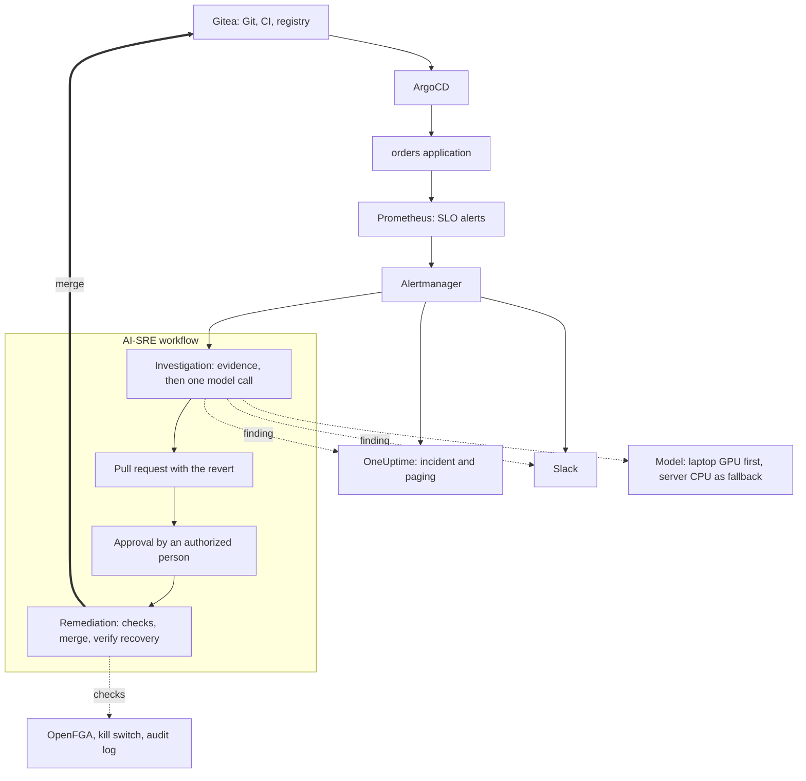

# AI-SRE Engineering

This repository documents an AI-assisted incident workflow and the SRE platform underneath it, built
and run on a single rented server. It records the engineering: why things were built the way they
were, what was measured, what broke, and what changed afterwards.

## In short

What happens when a bad deploy degrades a service:

- An SLO alert fires and starts an investigation. Nobody is involved.
- The investigation collects evidence and asks a small self-hosted language model one question.
- It opens a pull request reverting the commit it holds responsible. **The pull request is open 17
    seconds after the alert arrives.**
- The cluster is untouched until someone authorized for the service approves.
- A separate account merges, ArgoCD rolls the change out, and recovery is confirmed from telemetry.

| Result | Measured |
|---|---|
| Alert to a fix ready for approval | 17 s |
| Drills where the right commit was named | 5 of 5 |
| Investigation time across those drills | 8 to 13 s |
| Approval by someone not authorized | Refused and logged; nothing changed |
| Kill switch off | Finding delivered, no fix proposed |

How it is built:

- **No hosted AI API.** The model was chosen from 23 small candidates. It runs on a laptop GPU when the
    laptop is online, and otherwise on the server: 4 cores, 32 GB, no GPU.
- **The model's role is deliberately small.** It answers one question in a fixed format. Collecting
    evidence, building the fix, checking who may approve and verifying recovery are ordinary code.
- **Three identities.** Proposing, approving and merging are done by different accounts. Each step is
    checked against OpenFGA and written to an audit log before it happens.
- **Measured on the live platform.** The results come from drills with a known cause.

The results are also narrow: one type of fault, one alert, one permitted action and five runs. See
[Limits](#limits).

## Architecture

The design keeps three jobs apart that tend to get merged:

- **Detection:** alert rules decide that something is wrong.
- **Diagnosis:** the workflow works out what caused it. This is the only place the model is involved.
- **Recovery:** telemetry decides whether it is fixed.

Every service has a public DNS name and a real certificate, and none of them is reachable except over
a WireGuard tunnel.

## What was built

**The platform**

- A single-node Kubernetes cluster with about 65 pods in 20 namespaces.
- Every step of building it is a script that can be run again.

| Area | Components |
|---|---|
| Access and networking | WireGuard, Traefik, a Let's Encrypt wildcard certificate |
| Delivery | Gitea with CI runners and a registry, ArgoCD |
| Identity and authorization | Authentik, OpenFGA, Kyverno |
| Observability | OpenTelemetry Collector, Prometheus, Alertmanager, GreptimeDB, Perses, blackbox exporter |
| Incident response | OneUptime, Slack |
| AI | Ollama, OpenLIT |
| Failure testing | Chaos Mesh, plus bad-deploy and observability-outage drills |
| Secrets and storage | SOPS with age, MinIO |
| Also installed | Backstage, Velero, Falco, SPIRE |

**The SRE layer**

- SLO alerts that have unit tests.
- Telemetry split into per-service tables.
- 20 dashboards generated from code.
- An on-call and incident process, runbooks and a service catalogue.
- A full incident used as the platform's acceptance test: injected fault, page, rollback and verified
    recovery. It had to pass three times in a row.

**The AI-SRE workflow**

- Four read-only evidence tools and a single model call.
- A trace of every run.
- An alert trigger.
- A remediation path guarded by separate identities, a kill switch and an audit log.

## Decisions that shaped it

- **A fixed workflow instead of an agent.**
    - The small models that fit this hardware could not run an investigation on their own. Left to
        choose tools and decide when to stop, the selected model failed both live attempts (58 and 125
        seconds, no valid answer).
    - With code gathering the evidence and the model making one judgement, it was right in all five
        drills.
- **Fixing the evidence instead of the prompt.**
    - When the model blamed a revert for an incident, a new prompt rule did not stop it, and neither did
        annotating the evidence.
    - Leaving the reverted pair of commits out of the input did.
- **A laptop as the first inference tier.**
    - The laptop's GPU answers in about 4 seconds; the server's CPU takes 12 to 21.
    - Requests go to the laptop first and fall back to the server. Traefik does the failover, so the
        workflow has no routing code.
- **Approval as a pull request review.**
    - The approver sees the actual diff, and Gitea records who approved. No chat integration is needed.
    - The account that proposes a fix cannot merge it. An approval from someone not authorized changes
        nothing.
- **Authorization and audit kept separate.** OpenFGA answers whether an action is allowed. The audit
    log records what happened.
- **Recovery judged from telemetry.** ArgoCD reported the application healthy before the service had
    recovered, so "recovered" is defined by error rate and latency over time.
- **Removing what was not used.** A policy engine, a message bus, a model gateway and a custom report
    page were built or deployed and later taken out.

## Technical pieces

The detail is in the technical pieces, listed in the sidebar in four groups:

- **AI-SRE and AI engineering:** the investigation workflow, the model behind it, how it is traced,
    evaluated and kept safe.
- **SRE and reliability:** alerting, incident handling, recovery and observability.
- **Platform and infrastructure:** delivery, identity, authorization, networking and secrets.
- **Engineering judgment:** what was removed, when the checks were wrong, and how the work was done.

Each piece takes one problem and follows it through: what the constraints were, what was tried, what
the measurements said, what broke and what was changed because of it. More pieces are added as they
are written.

A good place to start is
[From Alert to a Fix Ready for Approval in 17 Seconds](ai-sre/01-alert-to-fix-ready-for-approval.md).

## Evidence

- Each piece carries its own evidence: test output, benchmark tables, audit records and screenshots
    from the running system.

## Limits

- **This is a lab.** One node, one application, synthetic load, no real traffic and a single operator.
- **One kind of fault.** The diagnosis has been graded only on a bad configuration commit.
- **One alert, one action.** One alert can start a run, and a GitOps revert is the only action that
    can be proposed.
- **Five drills are not an accuracy figure.** They show the path works end to end.
- **Narrow evidence.** The workflow reads alerts, service health and Git history. It does not yet read
    logs or traces.
- **Some of the platform is installed but barely exercised.** Backups have never been restored as a
    test, Falco's alerts are not routed anywhere, and Kyverno has a single tested policy.

## Licence

The text and images in this repository are licensed under
[Creative Commons Attribution 4.0 International](https://creativecommons.org/licenses/by/4.0/).
